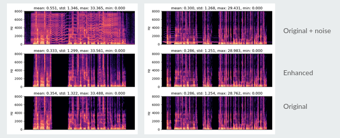

# Speech denoiser for slavic domain 
Based on "Real Time Speech Enhancement in the Waveform Domain (Interspeech 2020)"
Model's code was taken from here https://github.com/facebookresearch/denoiser

## TRAIN w YOUR OWN DATASET
1. During trianing I used pytorch lighting and Sacred for logging, you may want to use different logger. 
2. It's possible to train Unet as a baseline, just change the model in train_pl.py. Code for Unet is in 'model' folder and it was taken from here together with some other code snippets:
https://github.com/haoxiangsnr/Wave-U-Net-for-Speech-Enhancement .
Config file contains parameters for Unet.

## EXAMPLES & INFERENCE
**inference** folder contains usage examples with a few enhanced files. 
Model accepts an audio file in wav format and produces a 'cleaner' veriosn of it with some noise removed.

## MODEL WEIGHTS
You can download model weights here:
https://drive.google.com/file/d/1Ih8pZ3n4i6VXgwKFYQfMWu3PwCiPtgpG/view?usp=sharing

## DATASETS
Training dataset was a collection of different datasets mixed with noise files. 

### Open datasets:
SEGAN 11572 files used.
https://pdfs.semanticscholar.org/ed99/08f71d6521a45093ffc0f9365315c1183604.pdf

### Generated dataset:
Clean and noisy files were mixed with random SNR value, additionally white noise was added randomly with different SNR value. For more details check **noisy_records_generator** folder, it containes files and configs for dataset generation.

##### Clean speech files subsets:
1. Russian Open Speech To Text   
*substes used*
- Public_youtube700_val 7311 file
- Buriy_audiobooks_2_val 7850 files
- Asr_calls_2_val 12950 files 

2. M-AILABS Speech Dataset  (audio books, a few speakers)
*substes used*  
- Ukrainian 31543 files
- Russian 29440 files

##### Noise files subsets:
1. FSDnoisy18k 9473 files used
2. TAU Urban Acoustic Scenes 9072 files used

##### Final dataset contained about 150.000 files, some clean files were used several times with different types of noise.

## METRICS & RESULTS
Model was trained 400 epochs. I have not checked quality on VCTK or other public datasets and used a subset of generated dataset with 4k files for validation.
Scores may look a little bit low because some of the files in "Russian Open Speech To Text" are noisy but they were needed to add speakers diversity. 
### Scores:
STOI: 0.941  
PESQ: 2.79  

An example before and after.

